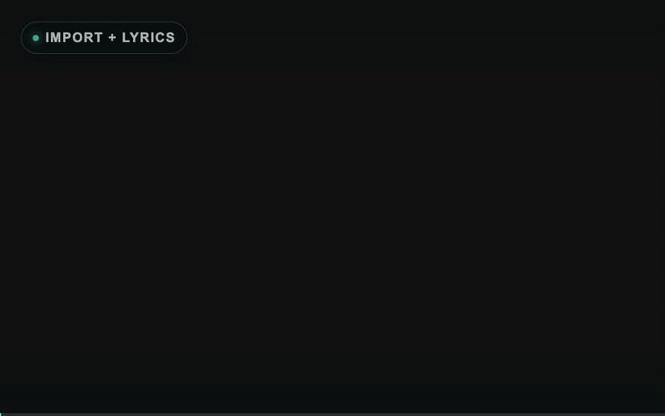

# lyricstapper

Manual lyric timing for music. Paste finished lyrics, hold a key while each line
is sung, refine line and word timing, then export subtitle files or a captioned
MP4.

> Tap your lyrics into time.



[Watch the demo with sound](docs/assets/demo/lyricstapper-demo.mp4) · [Demo song and attribution](docs/assets/demo/README.md)

## Status

The current release is [v0.1.0](https://github.com/Hyperrick/lyricstapper/releases/tag/v0.1.0),
the first public version of lyricstapper.

## Origin

I started lyricstapper while making Reels for my hobby music project,
**Beats of Binary**. I wanted timed lyrics that followed the music closely, but
the editing tools I tried put this focused workflow behind a subscription.

The result is a narrow tool for one task: paste known lyrics, tap them into time,
adjust the result and export it. The interface uses
[Astryx](https://github.com/facebook/astryx), Meta's MIT-licensed open-source
design system.

## Features

- Hold `Space` to mark the visible duration of each lyric line
- Separate Tag and Edit modes to prevent accidental timing changes
- Drag, trim and multi-select line or word blocks on a zoomable timeline
- Keep instrumental gaps free of captions
- Preview vertical and horizontal media without altering the source
- Style captions and active-word highlighting with presets
- Import lyricstapper projects, caption JSON, SRT and ASS
- Export SRT, styled karaoke ASS, word-timing JSON and project files
- Burn styled captions into an MP4 locally in a compatible browser

## Privacy and local data

lyricstapper has no application backend, account system, telemetry, advertising
or upload endpoint. Source media and project contents stay in the browser.

The browser may store the following local data:

- theme, editor layout and caption-style preferences in Local Storage
- file or directory handles in IndexedDB after the user explicitly chooses them

Remembered handles remain subject to browser permission checks. Clearing site
data removes these preferences and handles. Project files contain captions,
style settings and a reference to the media filename; they do not contain the
media itself.

## Browser support

A current Chromium-based browser provides the complete workflow:

- The File System Access API enables remembered files and in-place project saves.
- WebCodecs and `OffscreenCanvas` are required for local MP4 rendering.

Other current browsers can use the regular file-picker fallback and text-based
imports and exports, but remembered handles or MP4 rendering may be unavailable.
Browser support also depends on the codecs available on the device. The original
media is never modified.

## Local development

Requirements:

- Node.js 22.23.2 or newer
- npm 10 or newer

```bash
nvm use
npm ci
npm run dev
```

Open <http://localhost:3000>.

## Basic workflow

1. Open an audio or video file.
2. Paste finished lyrics and prepare the caption lines.
3. Start playback and hold `Space` for each sung line.
4. Refine line and word timing in Edit mode.
5. Choose a caption style.
6. Save a project or export JSON, SRT, ASS or MP4.

## Docker

Build and start the production container:

```bash
docker compose up --build -d --wait
docker compose ps
curl --fail http://127.0.0.1:3000/
```

Follow logs or stop the service without deleting anything:

```bash
docker compose logs -f lyricstapper
docker compose stop lyricstapper
```

The default Compose configuration binds to `127.0.0.1:3000`. To use a different
local port:

```bash
LYRICSTAPPER_PORT=8080 docker compose up --build -d --wait
```

Set `LYRICSTAPPER_BIND_ADDRESS` only when the service deliberately needs to
listen on another interface. For internet-facing use, put the container behind
an HTTPS reverse proxy and set HSTS at that proxy. The application provides CSP,
frame, MIME-sniffing, referrer and permissions headers itself.

The container runs as an unprivileged user and includes a health check. It does
not need a database or persistent volume because all product data remains in the
browser.

## Project files and import limits

Project files use the suffix `.lyricstapper.json`. Legacy `.beatmark.json`
project files with format version 1 remain importable.

All imported project, JSON, SRT and ASS files are treated as untrusted input.
Current safety limits are:

- 5 MB per imported text file
- 10,000 caption lines
- 4,000 characters and 1,000 words per caption line
- 24 hours of timeline duration
- 16,384 pixels per saved media dimension

Invalid fields, timestamps, word ranges and caption-style values are rejected
instead of silently entering the editor.

## Known limitations

- lyricstapper does not cut media, add transitions, transcribe audio, translate
  lyrics or upload files.
- MP4 export availability and supported codecs vary by browser and operating
  system.
- Large or high-resolution videos can require substantial memory and processing
  time because rendering happens locally.
- File and directory handle persistence is currently Chromium-specific.
- There is no collaborative editing, cloud sync or mobile-native app.

## Quality checks

```bash
npm run typecheck
npm run lint
npm test
docker compose build
```

`npm test` builds the production application, checks source-file size and runs
the deterministic unit and rendered-HTML tests.

## Architecture

See [docs/architecture.md](docs/architecture.md) for module responsibilities,
the local-data boundary and project-format rules.

## Contributing and security

- [CONTRIBUTING.md](CONTRIBUTING.md) explains the development workflow.
- [SECURITY.md](SECURITY.md) explains private vulnerability reporting.
- [CHANGELOG.md](CHANGELOG.md) tracks release-facing changes.

Do not attach private songs, lyrics or project files to public issues. Use a
minimal synthetic reproduction instead.

## License

lyricstapper source code is available under the [MIT License](LICENSE).
Bundled fonts and dependencies retain their own licenses; see
[THIRD_PARTY_NOTICES.md](THIRD_PARTY_NOTICES.md).
